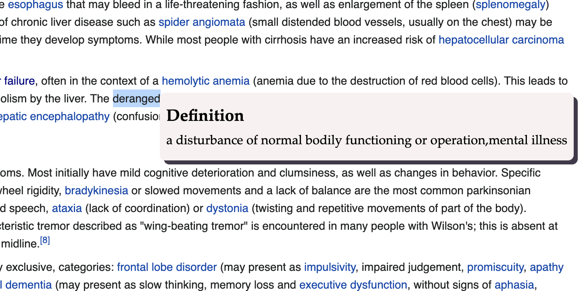
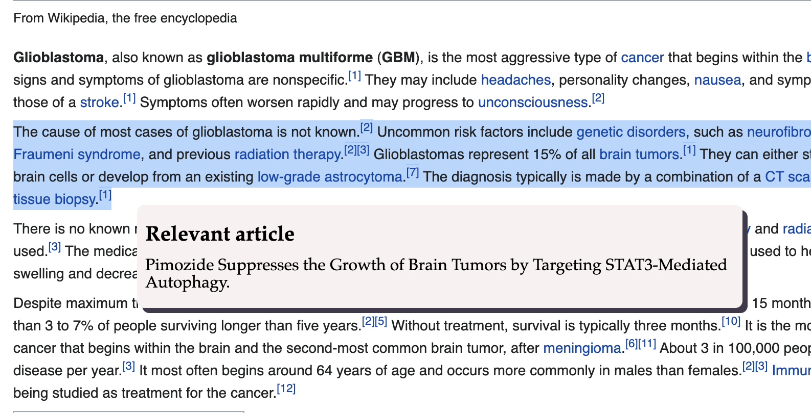

# start-jarjargone
Tired of medical jargon all over the place? Well, jargon is now jargone.
Check out our web tool for medical definition and reading suggestions on-the-go - Find out in real-time, all in one window.

## Description
### Problem space: 
Helping patients or the layperson to quickly access the definition of medical terminology without leaving the page, just with a simple selection of the word, and handling misinformation and empowering patients by providing suggested reading from trusted sources.

### Impact: 
By having the tool as a browser extension, we can eliminate the steps of uploading the document onto a separate app - this also means that the patient does not need to leave their screen when reading quickly across sources. With further design this could improve accessibility,  ease to use, and user-friendliness to all groups of people (i.e. our design is much easier to explain to less tech-savvy people). Our tool also provides a workaround for apps that do not process URLs which are not open-access (e.g. institutional log in methods, account based html document). Our tool also aims to handle misinformation and improve the decision making processes for patients by providing suggested reading material from trusted sources.

### Features
JavaScript in the front-end (for the Chrome extension), Python (along with various libraries) for the backend pre-processing, as well as Microsoft Azure services for server hosting. The Python back-end processes JSON data sent from chrome extension and returns a suggested article generated by our neural network model trained on more than 6k PubMed articles on cancer. The chrome extension itself is connected to Merriam-Webster Medical dictionary. Our demo demonstrates the reaction speed of both features.
[Demo Video Link](https://www.youtube.com/watch?v=cbdzcp31CLI) 


### Demo:

<br/>
Definition
<br/>

<br/>
Article suggestion (to be improved)

---
**Status: under development** 

To test out our project, please follow the below instructions:
### FRONTEND 
1. Go to chrome://extensions/
2. Click 'Load unpacked'
3. Navigate to project folder and select 'extension' directory

### BACKEND 
1. Follow instructions at https://flask.palletsprojects.com/en/1.1.x/installation/ for setting up virtual environment for Windows or Mac
2. Install requirements
```
$ pip install -r requirements.txt
```
3. Run flask app locally
```
$ export FLASK_APP=py-script/main.py
$ flask run
```

Note: 2 more important requirements are needed to run this extension
 * Neural network model file (d2v.model) which is too large to be pushed to Github. Please contact the developers directly. The new directory containing the model should be /py-script/model/d2v.model

 * Merriam webster API key to replace keyword 'hidden' in content.js on line 90
